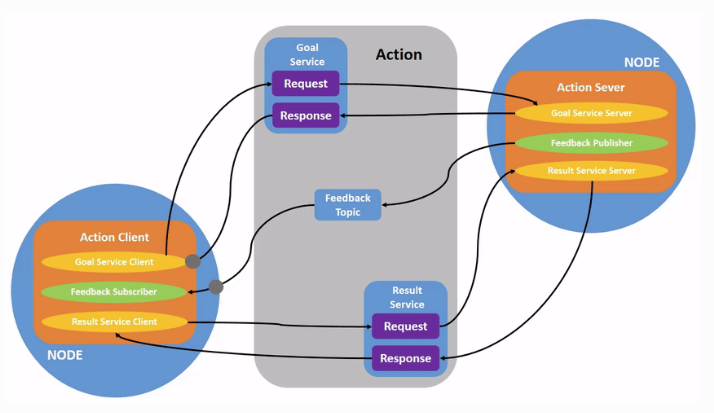

# action笔记

ros action是topic 和 service的结合升级版，专门针对某些特殊使用场景，执行时间、执行过程需要连续反馈，比如ros系统给机器人下达目标点，机器人运动到目标点需要一段时间，并且ros系统需要机器人连续的运动反馈，这是控制过程常见的场景。

工作结构图如下。



ROS官方已经为我们实现了内部细节，我们只需关注下面几个部分：

1. 编写action文件。定义请求，返回，反馈，这三个部分。
2. 实现服务端。创建action server。
3. 实现客户端。创建action client。

本项目实现自定义action，客户端给服务端发送一个数N，服务端从0开始计数到N，中间间隔1秒，连续给客户端反馈进度，计数结束再进行反馈。

## action文件

```
# action/AddInts.action
# 请求
int32 num
---
#最终结果
int32 result
---
#连续反馈
float64 progress_bar
```

cmakelists.txt

```cmake
add_action_files(
  FILES
  AddInts.action
)
generate_messages(
  DEPENDENCIES
  actionlib_msgs#   std_msgs
  std_msgs
)
catkin_package(
 CATKIN_DEPENDS actionlib actionlib_msgs roscpp rospy std_msgs
)
```

catkin_make编译之后，会分别生成cpp和python的引用文件，分别在devel/include和devel/lib/python3下面。

## 服务端核心代码

服务端需要完成action server实例化、发送连续反馈、结束时反馈。

```cpp
#include "actionlib/server/simple_action_server.h"
#include "learning_custom_action/AddIntsAction.h"
#include "ros/ros.h"

typedef actionlib::SimpleActionServer<learning_custom_action::AddIntsAction> Server;
// 实例化server
Server server(nh, "addInts", boost::bind(&cb, _1, &server), false);
server.start();
//server收到请求时的回调函数
void cb(const learning_custom_action::AddIntsGoalConstPtr &goal, Server *server) {
    //连续反馈
    learning_custom_action::AddIntsFeedback feedback;
    server->publishFeedback(feedback);
    //最终结果
    learning_custom_action::AddIntsResult r;
    server->setSucceeded(r);
}
```

## 客户端核心代码

1. 实例化客户端
2. 编写三个回调函数：第一次激活时、连续反馈、最终结果。
3. 发送客户端请求

核心代码如下：

```cpp
#include "actionlib/client/simple_action_client.h"
#include "learning_custom_action/AddIntsAction.h"
#include "ros/ros.h"

typedef actionlib::SimpleActionClient<learning_custom_action::AddIntsAction> Client;
//实例化client
Client client(nh, "addInts", true);
client.waitForServer();
//发送请求
learning_custom_action::AddIntsGoal goal;
goal.num = 10;
client.sendGoal(goal, &done_cb, &active_cb, &feedback_cb);
ros::spin();
```

## 功能包使用方法

```shell
mkdir -p ~/catkin_ws/src
cd ~/catkin_Ws/src
git clone ...
cd ~/catkin_ws
catkin_make
source ./devel/setup.bash
# 启动服务端
rosrun learning_custom_action action_server
# 启动客户端
rosrun learning_custom_action action_client
```

## 完整项目
完整项目请查看github[仓库](https://github.com/LadissonLai/learning_custom_action)。


